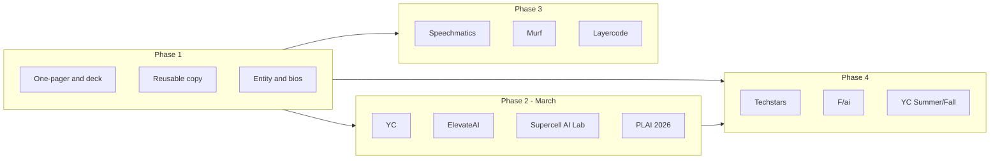

# Startup Incubator Application Plan (Dreamflow AI + Game Voice Translation)

Apply to every relevant program identified, ordered by deadline and fit. Reuse one core application narrative and tailor per program.

---

## Phase 1: Materials to Prepare Once (Do First)

- **One-pager / pitch deck (8–12 slides)**
  - Problem (language barrier in gaming / AI workflow gap), solution (live voice translation mod / Dreamflow), traction, team, ask.
  - Separate slide or appendix for “Game Voice Translation” vs “Dreamflow AI” so you can lead with the right product per program.
- **Reusable application copy**
  - 1–2 sentence tagline for each product.
  - 50-word, 150-word, and 300-word company descriptions.
  - Clear “what we’ve built” (e.g. CSGO2 mod, Dreamflow MVP) and “what we need” (credits, funding, mentorship).
- **Logistics**
  - Decide primary entity (one company with two products vs two projects under one umbrella).
  - Have founder bios, LinkedIn, and (if applicable) demo video or link to repo/playable mod ready.

---

## Phase 2: Apply Immediately (March 2026)

| Program              | Action                                                                             | Lead product                          | Link / note                    |
| -------------------- | ---------------------------------------------------------------------------------- | ------------------------------------- | ------------------------------ |
| **Y Combinator**     | Submit or update application (late Spring 2026 or Early Decision Summer/Fall 2026) | Both; emphasize AI + gaming/voice     | apply.ycombinator.com          |
| **ElevateAI**        | Check if applications still open; submit with gaming/voice angle                   | Game Voice Translation                | joinelevateai.com/apply        |
| **Supercell AI Lab** | Confirm Spring 2026 deadline; submit if open                                       | Game Voice Translation                | Supercell AI Lab official site |
| **PLAI Call 2026**   | Confirm 2026 application window; submit                                            | Dreamflow AI (and translation if B2B) | plai-accelerator.com/call-2026 |

---

## Phase 3: Credits & Partner Programs (Anytime in 2026)

Apply when you’re ready to use their APIs; no strict batch deadline.

| Program          | What you get                      | Best for                                          |
| ---------------- | --------------------------------- | ------------------------------------------------- |
| **Speechmatics** | $50K+ credits, technical guidance | Game Voice Translation (speech/translation stack) |
| **Murf**         | ~$1.5K credits, 3 months          | Voice/TTS for Game Voice Translation or Dreamflow |
| **Layercode**    | $2K credits, office hours         | Voice AI / accessibility angle                    |

**Action:** Apply to all three; use same one-pager and short product description; mention “live game voice translation” and “AI workflow” where relevant.

---

## Phase 4: Later 2026 Batches (Track & Apply When Open)

| Program                   | When to check | What to do                                                                                                            |
| ------------------------- | ------------- | --------------------------------------------------------------------------------------------------------------------- |
| **Techstars**             | Q2 2026       | Watch for Summer/Fall 2026 program announcements; apply as soon as applications open (often 2–3 months before batch). |
| **F/ai (Station F)**      | Early 2026    | Check Station F / F/ai site for 2026 cohort dates; apply for cohort that fits (model credits for both products).      |
| **YC Summer / Fall 2026** | Already open  | If not applied in Phase 2, submit via Early Decision for Summer or Fall 2026.                                         |

---

## Phase 5: Optional / Regional

- **AI Ventures Accelerator 2026 (VC4A/Technovation)** — If you have a co-founder or team member who fits (e.g. young women 19–24 in UNICEF program countries), consider applying for equity-free seed and training.
- **TechXpedite (Games24x7)** — If India-based or targeting India, check next cohort (e.g. 2026–27) and apply when applications open.
- **Rainmaking / APAC programs** — If targeting Southeast Asia or Japan, search “Rainmaking APAC accelerator 2026” and apply when the next cohort opens.

---

## Execution Order (Checklist)

1. **Week 1:** Build one-pager and 50/150/300-word descriptions; finalize “one company, two products” or “two projects” framing.
2. **Week 1–2:** Submit YC, ElevateAI, Supercell AI Lab, PLAI (all that are still open).
3. **Ongoing:** Apply to Speechmatics, Murf, Layercode with same materials.
4. **Q2 2026:** Add Techstars and F/ai to calendar; apply when applications open.
5. **Monthly:** Re-check ElevateAI, Supercell, PLAI, Techstars, F/ai for new cohorts or late application options.

---

## Diagram: Application Flow

Use this plan as a single checklist; update it as you submit and as program deadlines or links change.
