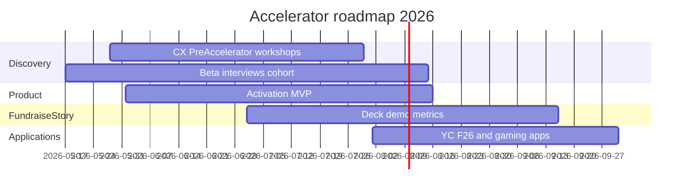

# Fall 2026 Top Accelerator Readiness Plan

## Executive summary

You have a **real shipped product** (Electron + FastAPI, v1.0.0 installers in [`dist/`](dist/)) and strong **technical differentiation** (offline, bidirectional, privacy-first) documented in [`docs/COMPETITIVE_GRADING_ASSESSMENT.md`](docs/COMPETITIVE_GRADING_ASSESSMENT.md). What top programs (YC F26, Techstars, gaming-focused labs) will weigh most heavily is still **missing**: **behavioral traction** (activated users who return), **customer-discovery evidence** (not ad clicks), and **application assets** (deck, demo video, metrics one-pager).

Your positioning for fall 2026: **SquadSpeak only** — one problem, one ICP, one product.

The **CX Pre-Accelerator** (May 28 → July 30 capstone) is the validation engine; **June–August** is product hardening for activation; **July–September** is materials + applications.

---

## Current state (honest baseline)

| Area | Status | Accelerator implication |
|------|--------|-------------------------|
| Product | v1.0.0 builds exist; core loop implemented per [`docs/FEATURES_LIST.md`](docs/FEATURES_LIST.md) | Meets “working prototype” bar |
| UX / activation | Graded **C+** on setup; [`SetupWizard.tsx`](electron-app/react-frontend/components/SetupWizard.tsx) still uses **mock** device list; [`useAudio.ts`](electron-app/react-frontend/hooks/useAudio.ts) falls back to mocks if ML service fails | #1 risk in interviews (“setup blocked value”) |
| Traction | Website claims ~350K impressions / 1,126 clicks ([`product-website/app/page.js`](product-website/app/page.js)); **4 waitlist, 2 Kickstarter backers**; Reddit spend ~$350+ per marketing CSV | Clicks ≠ traction; weak vs YC/Techstars medians |
| Materials | Interview guide ready ([`docs/pitch_files/BETA_TESTER_INTERVIEW_GUIDE_1.md`](docs/pitch_files/BETA_TESTER_INTERVIEW_GUIDE_1.md)); **no deck/one-pager in repo**; incubator plan todos still **pending** ([`.cursor/plans/incubator_application_plan_70e82b74.plan.md`](.cursor/plans/incubator_application_plan_70e82b74.plan.md)) | Must ship by August |
| CREATE-X | Startup Launch declined; **CX Pre-Accelerator** invited | Use capstone as proof package for fall Launch reapply |

**What “competitive” means for fall 2026:** Not a longer feature list—a **credible beachhead** (who hurts weekly), **10–15 discovery interviews** with **5+ activated beta users** (2+ ranked sessions, subtitles working), **3+ strong WTP signals** or early paid pilots, and a **90-second demo** that shows the core loop in under 60 seconds.

---

## Strategic narrative (GVT only)

**One-liner (draft for all apps):**  
*SquadSpeak: real-time, offline voice translation for competitive gamers—subtitles from in-game voice chat without sending audio to the cloud.*

**ICP hypothesis to validate (narrow until interviews say otherwise):**  
Competitive PC players (Valorant / CS2 / Apex) in **mixed-language ranked stacks**, English + one other language, Windows, headset + in-game VC, pain **weekly+**.

**Do not lead with:** Dreamflow, VoiceHired, generic “AI platform,” or broad “15+ languages” before problem proof. Company name: **SquadSpeak**.

**Competitive frame:** LiveTranslate / EzDubs = cloud + friction; you = **in-match latency + offline + game-native overlay** ([`docs/COMPETITIVE_GRADING_ASSESSMENT.md`](docs/COMPETITIVE_GRADING_ASSESSMENT.md) sections 1–2).

---

## Phase 1: CX Pre-Accelerator + discovery (May 17 – July 30)

Align every workshop and 1:1 with outputs investors expect.

### Week-by-week

| When | Deliverable |
|------|-------------|
| **Now** | Confirm CX Pre-Accelerator spot (reply even if past May 12 deadline); block workshop dates (May 28, Jun 18, Jul 9, Jul 30, 10:00–11:30 ET) |
| **May 17–27** | Recruit **12–15** beta slots; send [`dist/BETA_TESTER_README.txt`](dist/BETA_TESTER_README.txt) + portable or installer build |
| **May 28 → Jun 18** | Complete **6** structured interviews using [`BETA_TESTER_INTERVIEW_GUIDE_1.md`](docs/pitch_files/BETA_TESTER_INTERVIEW_GUIDE_1.md); fill post-interview synthesis + traction counters after each |
| **Jun 18 → Jul 9** | **6** more interviews; refine ICP; discard weak personas (rare pain, install-only) |
| **Jul 9 → Jul 30** | **3** follow-up interviews with best ICP; test WTP ($7.99 / $12 / lifetime) |
| **Capstone (late July)** | 5-slide validation deck: Problem evidence → ICP → Solution demo → Traction table → Ask |

### Traction spreadsheet (create under `docs/pitch_files/`)

One row per interview/user; columns from your guide’s “Traction counters”: Activated, Repeat 2+ sessions, Would pay, NPS, Referral, Top blocker, Verbatim quote.

**Minimum capstone numbers to aim for:**

- 12+ interviews completed  
- 8+ used app in a **real match**  
- 5+ would use again (Y/Maybe → Y)  
- 3+ WTP at or above $7.99/mo **or** lifetime $40+  
- 2+ quotable problem stories (frequency × severity)

---

## Phase 2: Activation MVP (June 1 – August 15)

Accelerators fund **retention drivers**, not feature breadth. Fix what kills activation in beta interviews.

### P0 — Must ship before August applications

1. **Setup wizard uses real devices** — Replace mock in [`SetupWizard.tsx`](electron-app/react-frontend/components/SetupWizard.tsx) with same path as [`useAudio.ts`](electron-app/react-frontend/hooks/useAudio.ts) → `electronService.getAudioDevices()` / [`fastapi-backend/main.py`](fastapi-backend/main.py) `GET /audio/devices`.  
2. **“Time to first subtitle” metric** — Log setup duration + first successful translation in app or backend; target **&lt;15 min** median for beachhead ICP (your interview guide’s activation bar).  
3. **ML service reliability on cold start** — First-launch 30–60s delay ([`BETA_TESTER_README.txt`](dist/BETA_TESTER_README.txt)) needs visible progress + clear “ready” state so users don’t quit.  
4. **SmartScreen / trust** — Short in-app note + link to setup doc; code signing is ideal but costly—document workaround consistently for beta.  
5. **Remove or gate mock UI data** in demo paths ([`TeamStats.tsx`](electron-app/react-frontend/components/TeamStats.tsx), [`CommunicationAnalytics.tsx`](electron-app/react-frontend/components/CommunicationAnalytics.tsx), [`usePerformance.ts`](electron-app/react-frontend/hooks/usePerformance.ts)) so investor demos never show fake metrics.

### P1 — If interviews rank them top 3

- Anti-cheat / safety messaging (already have [`AntiCheatStatus.tsx`](electron-app/react-frontend/components/AntiCheatStatus.tsx)—surface in wizard)  
- 60–90s setup video embedded in [`HelpCenter.tsx`](electron-app/react-frontend/components/HelpCenter.tsx)  
- One-game beachhead polish (e.g. Valorant-only preset copy in wizard)

### Explicitly defer for fall apps

- macOS/Linux, team licenses, Discord integration, medium/large Whisper models — mention on roadmap slide only.

---

## Phase 3: Traction & GTM (June – September)

Reddit proved **interest** ([`Marketing Data Report 1.csv`](docs/pitch_files/Marketing Data Report 1.csv): V2 campaign ~1,047 page visits); conversion failed. Shift budget from impressions to **activated betas**.

| Channel | Action | Success metric |
|---------|--------|----------------|
| **Beta cohort** | 15 slots, Discord channel, weekly office hours | 8 activated, 5 repeat |
| **Communities** | r/Valorant, r/GlobalOffensive, r/apexlegends — **post with beta ask**, not product ads | 20 qualified signups |
| **Creator micro-test** | 1–2 small streamers (500–5K) free key + interview | 1 public clip showing subtitles in match |
| **Paid** | Pause broad Reddit until landing → beta funnel converts | CPA to **activated user**, not click |
| **itch/Gumroad** | Launch price test $7.99 with 5–10 design partners | 3 paid or LOI |

Update [`product-website/app/page.js`](product-website/app/page.js) traction stats only with **verified** activation/paid numbers (avoid stale “4 waitlist” if superseded).

---

## Phase 4: Application materials (July 1 – September 15)

All assets in [`docs/pitch_files/`](docs/pitch_files/) (new files—do not scatter).

### Core packet (build once)

| Asset | Spec |
|-------|------|
| **One-pager PDF** | Problem, ICP, solution, traction table, team, ask |
| **Pitch deck (10 slides)** | Problem → Why now → Solution → Demo screenshot → How it works → Market (TAM/SAM/SOM with sources) → Traction → Business model → Competition → Ask |
| **50 / 150 / 300-word** descriptions | Reuse across YC, Techstars, gaming forms |
| **90s demo video** | Screen capture: launch → setup → ranked/custom game → incoming subtitle → optional outgoing; no mock analytics |
| **Data room lite** | Traction spreadsheet, 3 anonymized interview quotes, competitive matrix excerpt |

### Founder / entity

- **Incorporate** (Delaware C-corp is YC-default) if not already—required for many programs  
- **Cap table** clean (solo OK; clarify if seeking co-founder in apps)  
- **GT path:** Strong CX capstone → **Startup Launch** reapplication for next cycle (winter/spring 2027 if fall batch missed)

---

## Phase 5: Fall 2026 application calendar

Track deadlines monthly; many open ~2–3 months before batch start.

| Priority | Program | Lead angle | Target window | Notes |
|----------|---------|------------|---------------|-------|
| **Tier 1** | **Y Combinator F26** | AI + gaming infra; offline voice | Apply **~Aug 2026** (batch Oct–Dec; Demo Day ~Dec 2, 2026) | Early Decision OK; update app with summer traction |
| **Tier 1** | **Techstars** (gaming or general) | Voice AI for global gaming | Watch Q2–Q3 2026 announcements | Apply day one when fall cohort opens |
| **Tier 1** | **CREATE-X Startup Launch** | GT-affiliated; prototype + discovery | Next app cycle post-capstone | Reference CX Pre-Accelerator learnings |
| **Tier 2** | **ElevateAI** | Gaming / voice | Rolling / cohort-based | [`incubator plan`](.cursor/plans/incubator_application_plan_70e82b74.plan.md) |
| **Tier 2** | **Supercell AI Lab** | Game voice / player comms | Confirm 2026 window | Strong fit if still open |
| **Tier 2** | **PLAI / F.ai** | Only if voice AI angle clear | Q2–Q3 | Lower priority per GVT-only focus |
| **Credits** | Speechmatics, Murf, Layercode | Reduce COGS / improve stack | Anytime | Strengthen “we ship” without changing narrative |

**Partner credits:** Apply when activation MVP stable—mention live beta + offline pipeline in [`fastapi-backend/whisper_service.py`](fastapi-backend/whisper_service.py).

---

## Metrics dashboard (targets by September 1)

Use these in deck + YC “progress” field:

| Metric | Today (approx.) | Fall target |
|--------|-----------------|-------------|
| Beta interviews | 0 structured | **12–15** |
| Activated users (subtitles in match) | Unknown | **8+** |
| Repeat users (2+ sessions) | Unknown | **5+** |
| Paid or committed WTP | 2 backers | **5+** at $7.99+ or equivalent LOI |
| Median time-to-first-subtitle | Unknown | **&lt;15 min** |
| NPS / recommend (0–10) | Unknown | **≥7** from ICP subset |
| Verbatim quotes | 0 curated | **3 problem + 2 value** |

**Narrative line for apps (only if true by August):**  
*“We interviewed N competitive players; X% report weekly language friction; Y% activated in ranked matches; Z would pay $7.99/mo.”*

---

## Risk register

| Risk | Mitigation |
|------|------------|
| Setup blocks activation | P0 wizard + audio docs + live beta support |
| Weak ICP (pain is rare) | Pivot beachhead game/segment in July, not product pivot ([`KICKSTARTER_PROJECT_OVERVIEW.md`](docs/KICKSTARTER_PROJECT_OVERVIEW.md) guidance) |
| Traction still click-based | Stop optimizing CTR; optimize activated beta |
| Dual-product confusion | **Resolved:** GVT only in all fall materials |
| Unsigned binary / SmartScreen | Beta script + roadmap item; don’t hide in app |
| Overbuilt demo with mock stats | Gate mocks before any investor recording |

---

## Recommended weekly rhythm (May–August)

- **Mon:** 1 beta support block + engineering P0  
- **Tue:** 1–2 customer interviews OR synthesis  
- **Wed:** Product / activation  
- **Thu:** GTM (community outreach, 1 post or 5 DMs)  
- **Fri:** Update traction spreadsheet + mentor prep for CX  

---

## Success criteria (September 2026)

You are **competitive for top fall programs** when you can truthfully claim:

1. **Sharp ICP** — one paragraph, backed by 12+ interviews  
2. **Behavioral proof** — 5+ repeat users in target segment  
3. **WTP** — pricing tested, not guessed  
4. **Demo** — 90s video of real product, no mocks  
5. **Honest deck** — ads as “channel test,” interviews as “validation”  
6. **Clear ask** — $500K seed / accelerator goals / use of funds (API credits, code sign, first hire)

Missing any of (1)–(3) is a bigger gap than missing macOS or extra languages.
